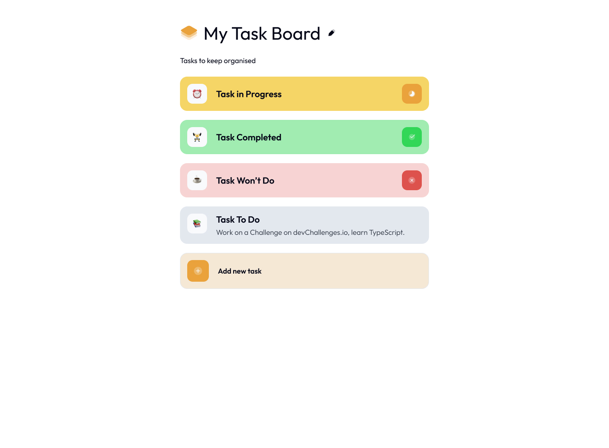

# My Task Board



My Task Board es una aplicación web diseñada para gestionar tareas de manera eficiente. Permite a los usuarios registrarse, iniciar sesión, crear, editar, eliminar y organizar tareas con diferentes estados e íconos personalizados.

## 📚 Tabla de contenido

- [Características](#características)
- [Tecnologías utilizadas](#tecnologías-utilizadas)
- [Implementación y estructura](#implementación-y-estructura)
- [Pruebas](#pruebas)
- [Despliegue](#despliegue)
- [Buenas prácticas y convenciones](#buenas-prácticas-y-convenciones)
- [Próximas mejoras](#próximas-mejoras)
- [Instalación y ejecución](#instalación-y-ejecución)
- [Cómo contribuir](#cómo-contribuir)

## Características

- **Registro e inicio de sesión**: Los usuarios pueden registrarse y autenticarse utilizando JWT almacenados en cookies.
- **Gestión de tareas**:
  - Crear nuevas tareas con un nombre, descripción, ícono y estado.
  - Editar tareas existentes.
  - Eliminar tareas.
- **Interfaz interactiva**:
  - Modal para agregar y editar tareas.
  - Animaciones y diseño responsivo.
- **Estados de tareas**: Las tareas pueden tener diferentes estados como "In Progress", "Completed" o "Won't do".
- **Íconos personalizados**: Los usuarios pueden seleccionar íconos para representar sus tareas.

## Tecnologías utilizadas

### Frontend
- **React x js**: Biblioteca para construir la interfaz de usuario.
- **CSS**: Para el diseño y las animaciones.
- **React Router**: Para la navegación entre páginas.

### Backend
- **Node.js**: Entorno de ejecución para el servidor.
- **Express**: Framework para manejar las rutas y la lógica del servidor.
- **MySQL**: Base de datos para almacenar usuarios y tareas.
- **JWT (JSON Web Tokens)**: Para la autenticación y autorización.

## Implementación y estructura

- **Estructura modular:** El proyecto está organizado en carpetas para componentes, hooks, recursos y lógica de negocio, facilitando la escalabilidad y el mantenimiento.
- **Custom Hooks:** Se utilizan hooks personalizados para la gestión de tareas, validaciones y contexto de usuario, promoviendo la reutilización de lógica.
- **Autenticación segura:** El backend implementa autenticación JWT con cookies httpOnly y control de expiración de sesión.
- **Protección de rutas:** Las rutas sensibles requieren un token válido; si expira o es inválido, el usuario es redirigido a la pantalla de login.
- **Feedback visual:** Se muestra un loading mientras se recuperan las tareas y mensajes de error claros en los formularios.

## Pruebas

- **Testing automatizado:** Se usan Vitest y React Testing Library para pruebas unitarias y de integración de componentes y flujos principales (login, registro, navegación, etc).
- **Mocks de API:** Las peticiones a endpoints protegidos están mockeadas en los tests para simular distintos escenarios de autenticación y respuestas del servidor.

## Despliegue

- **Variables de entorno:** El proyecto utiliza `.env` para gestionar claves y configuración sensible.
- **Preparado para producción:** El backend puede ejecutarse en cualquier entorno Node.js y el frontend puede ser desplegado en servicios como Vercel, Netlify o servidores propios tras compilar con Vite.

## Buenas prácticas y convenciones

- **Código limpio:** Uso de linters y formateadores para mantener la calidad y consistencia del código.
- **Componentes reutilizables:** Los componentes están diseñados para ser reutilizables y fáciles de mantener.
- **Separación de responsabilidades:** La lógica de negocio, presentación y acceso a datos están claramente separadas.

## Próximas mejoras

- Implementar notificaciones para tareas vencidas.
- Agregar soporte para subtareas y checklist dentro de cada tarea.
- Mejorar la experiencia móvil con un diseño más optimizado y responsivo.
- Agregar soporte para temas oscuros y claros.
- Permitir adjuntar archivos o imágenes a las tareas.
- Añadir filtros y búsqueda avanzada de tareas.
- Integrar autenticación con proveedores externos (Google, GitHub, etc).
- Añadir paginación o lazy loading para grandes volúmenes de tareas.
- Documentar la API REST con Swagger o similar.
- Implementar un sistema de roles y permisos para usuarios.

## Cómo contribuir

1. Haz un fork del repositorio.
2. Crea una rama para tu feature o fix: `git checkout -b feature/nueva-funcionalidad`
3. Haz tus cambios y escribe pruebas si aplica.
4. Haz un pull request describiendo claramente tu aporte.

## Instalación y ejecución

Sigue estos pasos para correr el proyecto en tu máquina local:

### 1. Clona el repositorio

```sh
git clone 
cd tu-repo/Board
```

### 2. Instala las dependencias

```sh
npm install
```

### 3. Configura las variables de entorno

Crea un archivo `.env` en la raíz del proyecto y agrega tus variables necesarias, por ejemplo:

```
SECRET_KEY=tu_clave_secreta
DB_HOST=localhost
DB_USER=tu_usuario
DB_PASSWORD=tu_password
DB_NAME=nombre_de_tu_base_de_datos
```

> **Nota:** No subas tu archivo `.env` al repositorio.

### 4. Configura la base de datos

- Asegúrate de tener MySQL instalado y corriendo.
- Crea la base de datos y las tablas necesarias según tu modelo (puedes agregar un script SQL en el repo si lo deseas).

### 5. Inicia el backend

```sh
node server/index.js
```
o si usas nodemon:
```sh
npx nodemon server/index.js
```

### 6. Inicia el frontend

En otra terminal, ejecuta:

```sh
npm run dev
```

### 7. Accede a la aplicación

Abre tu navegador en [http://localhost:5173](http://localhost:5173) (o el puerto que indique Vite).

---

**¡Listo!** Ahora puedes registrarte, iniciar sesión y comenzar a gestionar tus tareas.

---

### Opinión personal

Este proyecto representa una base sólida y modular para una aplicación de gestión de tareas. Aunque hay margen de mejora en aspectos visuales y algunas funcionalidades, he priorizado una arquitectura limpia y escalable, implementando autenticación segura, manejo de estado claro y pruebas automatizadas. Seguiré mejorándolo y agregando nuevas funcionalidades.

¿Tienes sugerencias o ideas? ¡Estaré encantado de recibir feedback o pull requests!